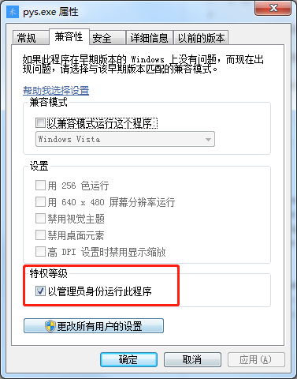

# PySwitch
PySwitch 是一个为 Windows 安装了多个 Python 环境提供快速切换的软件


## 使用

> -h ：帮助 

> -l : 当前安装的 Python 版本列表 

> -s : 环境切换 

> -v : 软件版本号 

使用范例
```bash
pys -s 3.6.8
```

## 安装
1. 下载 pys.exe 文件到本地
2. 将 pys.exe 所在目录添加到 path 环境变量中
3. 配置 config.conf
4. 为 pys.exe 添加管理员权限，属性 -> 兼容性 -> 以管理员身份运动




## config.conf
* env_path  ：pys.exe 所在目录
* [py_envs] ：py_envs 为电脑所安装的 python 环境（版本 = 安装路径）
